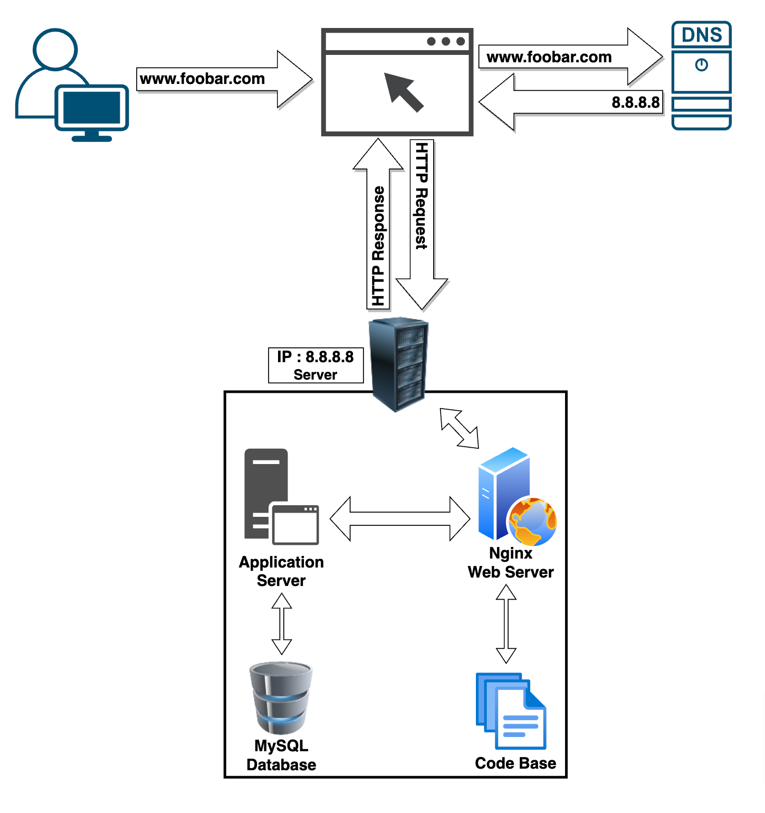

# Simple Web Stack

### Description

This is a simple web infrastructure that hosts a website that is reachable via `www.foobar.com`. There are no firewalls or SSL certificates for protecting the server's network. Each component (database, application server) has to share the resources (CPU, RAM, and SSD) provided by the server.

### Infrastructure Components:

#### 1. Server:
- **Definition:** A server is a computer system or software that provides functionality to other devices or programs, known as clients.
- **Role in this Infrastructure:** The server hosts and manages all components required for the website.

#### 2. Domain Name:
- **Role:** It acts as a human-readable alias for the server's IP address (e.g., 8.8.8.8) so that users can access the website using a memorable name (www.foobar.com).

#### 3. DNS Record for www.foobar.com:
- **Type:** `www.foobar.com` uses an **A record**. This can be checked by running `dig www.foobar.com`.**Note:** the results might be different but for the infrastructure in this design, an **A** record is used.
Address Mapping record (A Record)—also known as a DNS host record, stores a hostname and its corresponding IPv4 address.
- **Role:** It maps the www subdomain to the server's IP address (8.8.8.8), directing traffic to the correct server hosting the website.

#### 4. Web Server (Nginx):
- **Role:** The web server (e.g., Nginx) handles incoming HTTP requests from users' browsers and serves static content. It manages the initial request and serves web pages or routes requests to the application server.

#### 5. Application Server:
- **Role:** This server runs the website's application logic, handling dynamic content generation and business logic. It receives requests from the web server, processes them, and sends back responses to the web server for delivery to users.

#### 6. Application Files (Code Base):
- **Role:** This contains the website's codebase, including HTML, CSS, JavaScript, server-side scripts, and any other necessary files for the application to run.

#### 7. Database (MySQL):
- **Role:** The database (MySQL) stores and manages the website's data, such as user information, content, configurations, etc. It is accessed by the application server to fetch or update data as required by the application.

#### Communication with User's Computer:
- The server communicates with the user's computer via the HTTP/HTTPS protocol over the internet. When the user types www.foobar.com in their browser, a DNS lookup resolves the domain to the server's IP address (8.8.8.8). The user's browser then sends an HTTP request to the server for the website content.

### Issues with the Infrastructure:

#### 1. Single Point of Failure (SPOF):
- Since there's only one server, any failure in the server hardware or software can lead to the entire website being inaccessible.

#### 2. Downtime during Maintenance:
- During maintenance, such as deploying new code that requires restarting the web server, the website might experience downtime, impacting user access.

#### 3. Scalability Limitation:
- If the website experiences a sudden surge in traffic, a single server might not handle the load efficiently, causing performance issues or website downtime.

### Mitigation Strategies:
- Implementing load balancing and redundancy by adding additional servers.
- Employing strategies like clustering for the database to ensure fault tolerance.
- Utilizing content delivery networks (CDNs) to distribute content and reduce server load.
- Implementing automated deployment processes to minimize downtime during updates.

Enhancing the infrastructure's scalability, redundancy, and fault tolerance can address these issues, ensuring better performance and availability for www.foobar.com.
