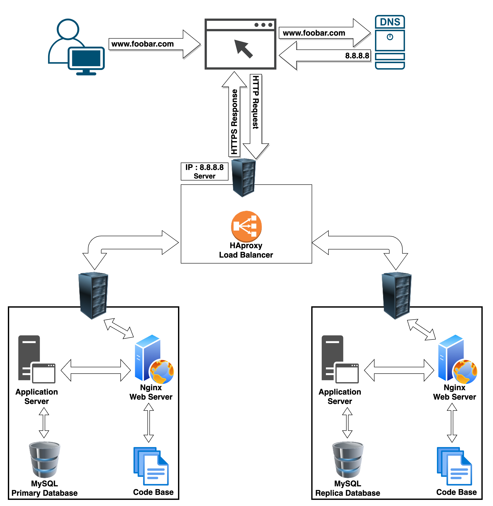

# Distributed Web Infrastructure

### Description

This is a distributed web infrastructure that atttempts to reduce the traffic to the primary server by distributing some of the load to a replica server with the aid of a server responsible for balancing the load between the two servers (primary and replica).

#### Components Added:

1. **Load Balancer (HAproxy):**
    - **Reason for Addition:** Introduce load balancing to distribute incoming traffic among multiple servers for better performance and reliability.
    - **Distribution Algorithm:** Round Robin - evenly distributes requests in a circular manner among the available servers.
    - **Active-Passive Setup:** The HAProxy load-balancer is enabling an *Active-Passive* setup rather than an *Active-Active* setup. In an *Active-Active* setup, the load balancer distributes workloads across all nodes in order to prevent any single node from getting overloaded. Because there are more nodes available to serve, there will also be a marked improvement in throughput and response times. On the other hand, in an *Active-Passive* setup, not all nodes are going to be active (capable of receiving workloads at all times). In the case of two nodes, for example, if the first node is already active, the second node must be passive or on standby. The second or the next passive node can become an active node if the preceding node is inactive.
    
2. **Additional Server:**
    - **Reason for Addition:** Introduce redundancy and scalability by having multiple servers to handle incoming traffic.
    
3. **Database Primary-Replica (Master-Slave) Cluster (MySQL):**
    - **Reason for Addition:** Ensure data redundancy, fault tolerance, and high availability of the database.
    - **Primary-Replica Setup:** The Primary node manages write operations and replicates data to Replica nodes. Replica nodes handle read operations and can serve as failover in case the Primary node fails.

#### Load Balancer Configuration:
- **Algorithm:** Round Robin - It cycles through the available servers in sequential order, distributing incoming requests evenly among them.
- **Active-Passive Setup:** The HAProxy load-balancer is enabling an *Active-Passive* setup rather than an *Active-Active* setup. In an *Active-Active* setup, the load balancer distributes workloads across all nodes in order to prevent any single node from getting overloaded. Because there are more nodes available to serve, there will also be a marked improvement in throughput and response times. On the other hand, in an *Active-Passive* setup, not all nodes are going to be active (capable of receiving workloads at all times). In the case of two nodes, for example, if the first node is already active, the second node must be passive or on standby. The second or the next passive node can become an active node if the preceding node is inactive.

#### Database Primary-Replica (Master-Slave) Cluster:
- **Functionality:** The Primary node handles write operations, ensuring data consistency and integrity. It replicates data changes to the Replica nodes.
- **Replica Node's Role:** It primarily handles read operations, serving as a backup in case the Primary node fails. It can also be used for scaling read-heavy operations to distribute the load.
- **+ How a database *Primary-Replica*(*Master-Slave*) cluster works:** A *Primary-Replica* setup configures one server to act as the *Primary* server and the other server to act as a *Replica* of the *Primary* server. However, the *Primary* server is capable of performing read/write requests whilst the *Replica* server is only capable of performing read requests. Data is synchronized between the *Primary* and *Replica* servers whenever the *Primary* server executes a write operation. 
**+ The difference between the *Primary* node and the *Replica* node in regard to the application:** The *Primary* node is responsible for all the write operations the site needs whilst the *Replica* node is capable of processing read operations, which decreases the read traffic to the *Primary* node.

### Issues with the Infrastructure:

#### Single Points of Failure (SPOF):
- Despite having multiple servers, if the load balancer or the database's Primary node fails, it can affect the entire system's availability.

#### Security Concerns:
- Lack of firewall: Exposing servers without proper firewall configurations increases the vulnerability to unauthorized access or attacks.
- No HTTPS: Transmitting data over HTTP instead of HTTPS makes it susceptible to interception or data breaches.

#### Absence of Monitoring:
- Without proper monitoring tools or systems in place, identifying and addressing performance issues or potential failures becomes challenging.

### Mitigation Strategies:

- **Redundancy:** Implement backup systems for critical components like load balancers and databases to mitigate SPOF.
- **Security Measures:** Configure firewalls, use SSL/TLS certificates for HTTPS encryption, and employ best practices for securing servers and databases.
- **Monitoring and Alerting:** Implement robust monitoring solutions to track system health, performance metrics, and security incidents, enabling proactive issue detection and resolution.

By addressing these issues and implementing mitigation strategies, the three-server web infrastructure for www.foobar.com can achieve improved reliability, scalability, and security.
