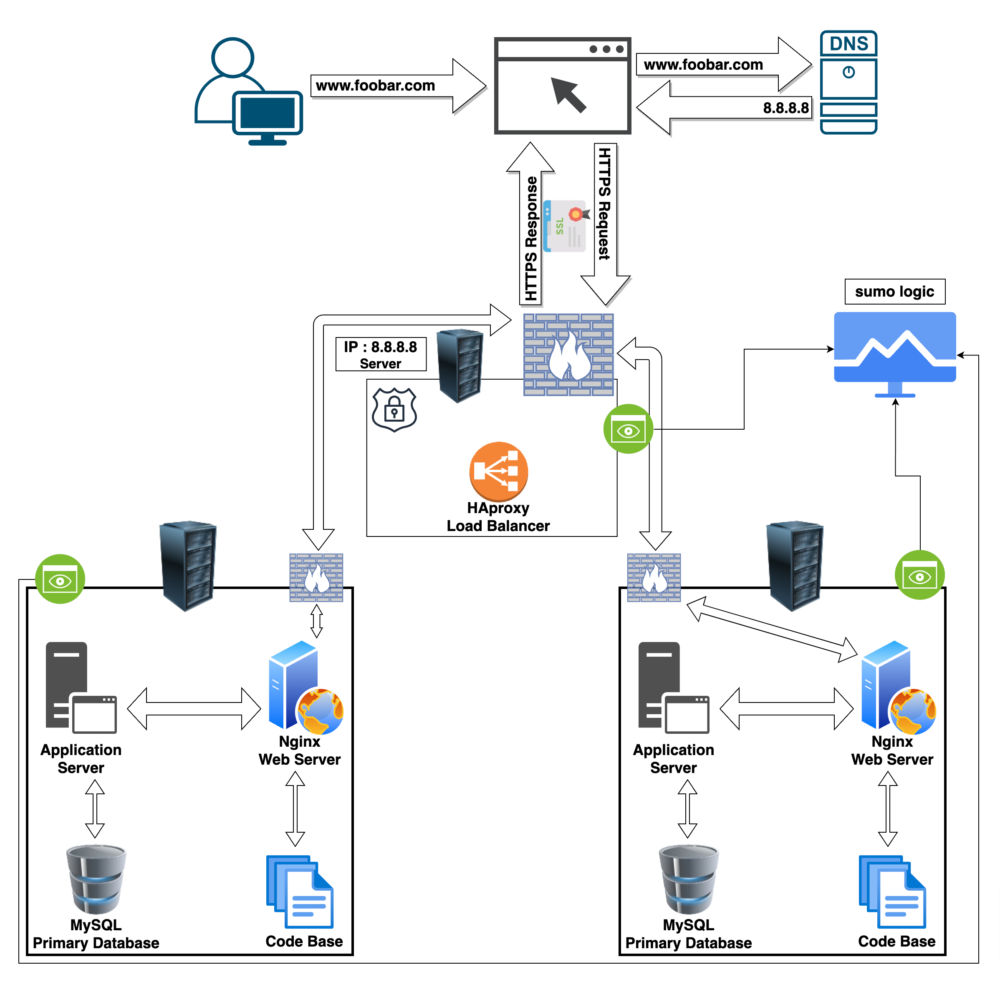

# Secured and Monitored Web Infrastructure

### Description

This is a 3-server web infrastructure that is secured, monitored, and serves encrypted traffic.

#### Components Added:

1. **Firewalls (3 in total):**
    - **Reason for Addition:** To secure the network and servers by controlling incoming and outgoing traffic based on defined security rules.
    
2. **SSL Certificate (for HTTPS):**
    - **Reason for Addition:** To encrypt data transmitted between clients and servers, ensuring secure communication.
    
3. **Monitoring Clients (e.g., Sumo Logic):**
    - **Reason for Addition:** To monitor system health, performance, security, and detect any anomalies or issues.
    
#### Explanation of Additional Elements:

#### Firewalls:
- **Purpose:** Firewalls are added to control and filter incoming and outgoing network traffic. They establish a barrier between trusted internal networks and potentially untrusted external networks, enforcing security policies.

#### HTTPS Traffic:
- **Reason for HTTPS:** HTTPS encrypts data transmitted between the user's browser and the web servers. It ensures confidentiality, integrity, and authenticity of data, preventing eavesdropping, tampering, or data theft.

#### Monitoring:
- **Purpose of Monitoring:** Monitoring is used to track system performance, resource utilization, security events, and identify potential issues or anomalies in real-time to ensure system reliability and security.

#### Monitoring Data Collection:
- **Sumo Logic or Similar Tools:** Monitoring tools collect data through agents or collectors installed on servers, collecting metrics, logs, and events. They transmit this data to a centralized platform for analysis and reporting.

#### Monitoring Web Server QPS (Queries Per Second):
- To monitor the QPS:
    - Implement monitoring tools that can track the incoming requests per second on the web servers.
    - Use server monitoring software to capture and analyze server logs or metrics related to incoming HTTP requests.

### Issues with the Infrastructure:

#### Terminating SSL at the Load Balancer Level:
- Terminating SSL at the load balancer can expose the unencrypted traffic within the internal network, potentially compromising data security.

#### Single MySQL Server Accepting Writes:
- Having only one MySQL server capable of accepting write operations poses a single point of failure. If this server fails, write operations become unavailable, affecting data integrity and application functionality.

#### Identical Components Across Servers:
- Using identical components across all servers might lead to homogeneity issues. If a vulnerability affects one server, it could potentially affect all others, increasing the overall risk.

### Mitigation Strategies:

- **SSL Termination:** Implement end-to-end encryption by maintaining SSL encryption throughout the entire network to avoid exposing sensitive data.
- **MySQL High Availability:** Set up a MySQL cluster with multiple nodes for redundancy and fault tolerance, allowing for failover in case of a primary server failure.
- **Diverse Component Versions:** Introduce diversity in component versions or configurations across servers to mitigate the risk of uniform vulnerabilities.

By addressing these issues and implementing mitigation strategies, the three-server web infrastructure for www.foobar.com can be made more resilient, secure, and robust in serving encrypted traffic while being effectively monitored.
