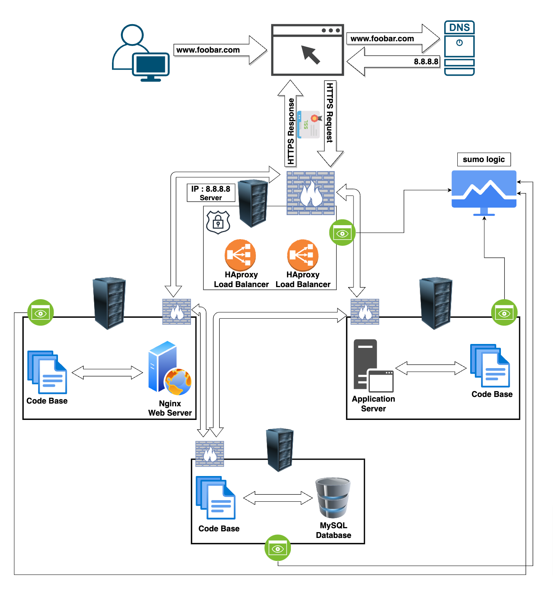

# Scaled Up Web Infrastructure

### Description

This web infrastructure is a scaled up version of the infrastructure described [here](2-secured_and_monitored_web_infrastructure.md). In this version, all SPOFs have been removed and each of the major components (web server, application server, and database servers) have been moved to separate GNU/Linux servers. The SSL protection isn't terminated at the load-balancer and each server's network is protected with a firewall and they're also monitored.

#### Components Added:

1. **Additional Server:**
   - **Reason for Addition:** To segregate and allocate specific functions (web server, application server, database) onto separate physical or virtual machines, improving performance, scalability, and security.

2. **Load Balancer (HAproxy) Cluster Configuration:**
   - **Reason for Addition:** Utilizing HAproxy as a load balancer cluster provides redundancy and fault tolerance, distributing incoming traffic among multiple load balancer nodes for high availability.

3. **Split Components Across Servers:**
   - **Web Server:** Hosts and serves static content, such as HTML, CSS, and JavaScript files.
   - **Application Server:** Runs the website's application logic, handling dynamic content generation and business logic.
   - **Database Server:** Manages and stores the website's data, handling read and write operations.

#### Explanation of Additional Elements:

#### Additional Server:
- **Purpose:** Separating components onto different servers enhances security by isolating different functionalities. It allows for better resource allocation, scalability, and easier management of specific components.

#### Load Balancer (HAproxy) Cluster:
- **Purpose:** Configuring HAproxy as a cluster offers high availability by distributing incoming traffic across multiple load balancer nodes. In case one node fails, others can continue handling requests, ensuring continuous service availability.

#### Split Components Across Servers:
- **Web Server:** Separating the web server allows for efficient handling of static content, reducing load on the application server and optimizing overall performance.
- **Application Server:** By dedicating a server to run the application logic, it ensures optimal resource utilization and isolation of critical application functions.
- **Database Server:** Isolating the database functionality onto its server ensures efficient data management, improved security, and easier scaling of storage and processing capabilities.

### Benefits of This Infrastructure:

1. **Improved Security:** Segregating components enhances security by minimizing the attack surface and allowing for specific security measures tailored to each component.

2. **Enhanced Performance:** Separating functionalities onto different servers optimizes resource allocation, reduces contention, and improves overall system performance.

3. **Scalability and Manageability:** Individual servers for distinct components facilitate easier scaling, maintenance, and management of the infrastructure.

### Issues With This Infrastructure

**+ High maintenance costs:** Moving each of the major components to its own server, means that more servers would have to be bought and the company's electricity bill would rise along with the introduction of new servers. Some of the company's funds would have to be used to buy the servers and pay for the electricity consumption needed to keep the servers (including the new and old ones) running.

By splitting components across servers and configuring a load balancer cluster, the infrastructure for www.foobar.com becomes more resilient, scalable, and efficient in handling incoming web traffic and application requests.